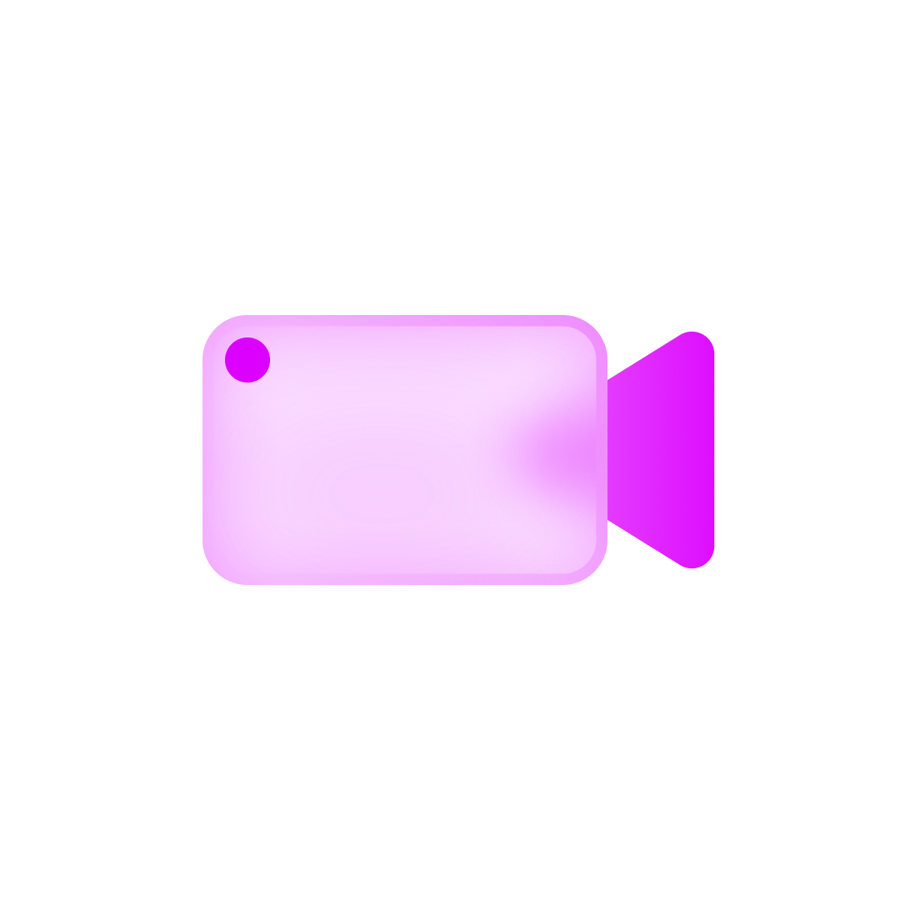
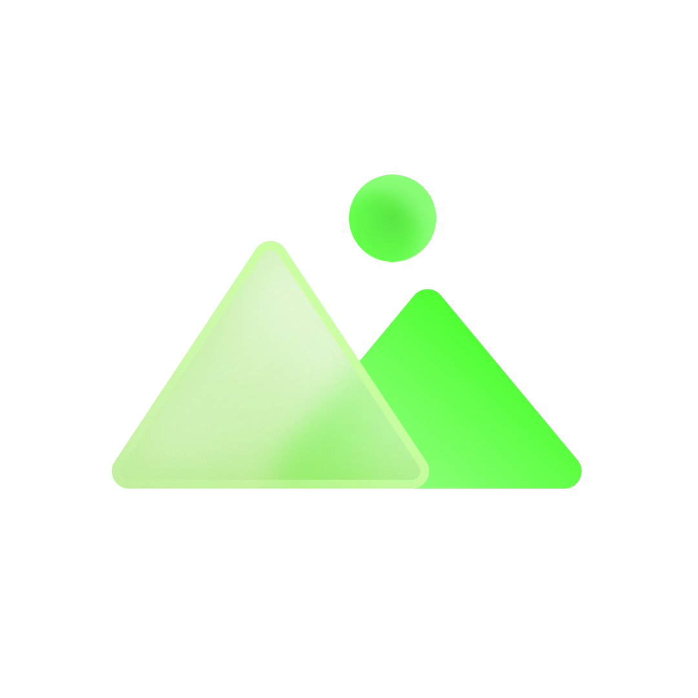

# Glass Icons

Glass Icons is a collection of CSS icons designed for various purposes. These icons are lightweight, customizable, and easy to use in web projects.

## Usage

To use Glass Icons in your project, simply include the CSS file in your HTML document:

```html
<link rel="stylesheet" href="https://cdn.jsdelivr.net/gh/rakeshkanna-rk/Glass-Icons/index.css">
```

| Class Name             | Image URL                             |
|------------------------|---------------------------------------|
| .Bomb-rk               |            |
| .SunnyCloud-rk         |    |
| .RainbowCloud-rk       |  |
| .SnowCloud-rk          |  |
| .RainnyCloud-rk        |  |
| .ThunderCloud-rk       |  |
| .Calendar-rk           |    |
| .Video-rk              |          |
| .Camera-rk             |        |
| .Contact-rk            |      |
| .Gallery-rk            |      |
| .Folder-rk             |        |
| .Heart-rk              |          |
| .Notes-rk              |          |
| .Phone-rk              |          |
| .Save-rk               |            |
| .Message-rk            |      |
| .zipfile-rk            |      |
| .Instagram-rk          |  |
| .Facebook-rk           |  |
| .Linkedin-rk           |  |
| .YouTube-rk            |  |
| .GitHub-rk             |   |
| .Pinterest-rk          |  |
| .Snapchat-rk           |  |
| .Whatsapp-rk           |  |
| .Telegram-rk           |  |
| .Threads-rk            |  |
| .Medium-rk             |    |
| .--500px-rk            |     |
| .Behance-rk            |  |
| .Figma-rk              |      |
| .Adobe-rk              |      |
| .AfterEffects-rk       |  |
| .--3M-rk               |            |
| .Notion-rk             |    |
-----------------------------------------
  
ㅤㅤㅤ
  
## [Check Usage](Usage.html)

```html
<i class="icon Class Name"></i>
```

## Contributing

Thank you for considering contributing to Glass Icons! Contributions are welcome and encouraged. To contribute to this project, please follow these guidelines:

1. **Fork** the repository and clone it to your local machine.
2. **Create a new branch** for your feature, improvement, or bug fix.
3. **Make your changes** and ensure they are thoroughly tested.
4. **Commit your changes** with descriptive commit messages.
5. **Push your changes** to your fork.
6. **Submit a pull request** to the `main` branch of the original repository.
7. **Provide a clear description** of your changes in the pull request, including any related issues or motivations for the change.

### Contribution Tips

- Ensure your code follows the existing code style and naming conventions.
- Include relevant test cases if applicable.
- Update documentation and README.md if necessary.
- Be respectful and constructive in your interactions with other contributors.

### Reporting Issues

If you encounter any bugs, have suggestions for improvements, or would like to request new features, please [open an issue](https://github.com/rakeshkanna-rk/Glass-Icons/issues). Provide as much detail as possible to help us understand and address your concern.

## Author  
### [Rakesh Kanna](https://github.com/rakeshkanna-rk)
  
## License
This project is licensed under the [MIT License](LICENSE)
